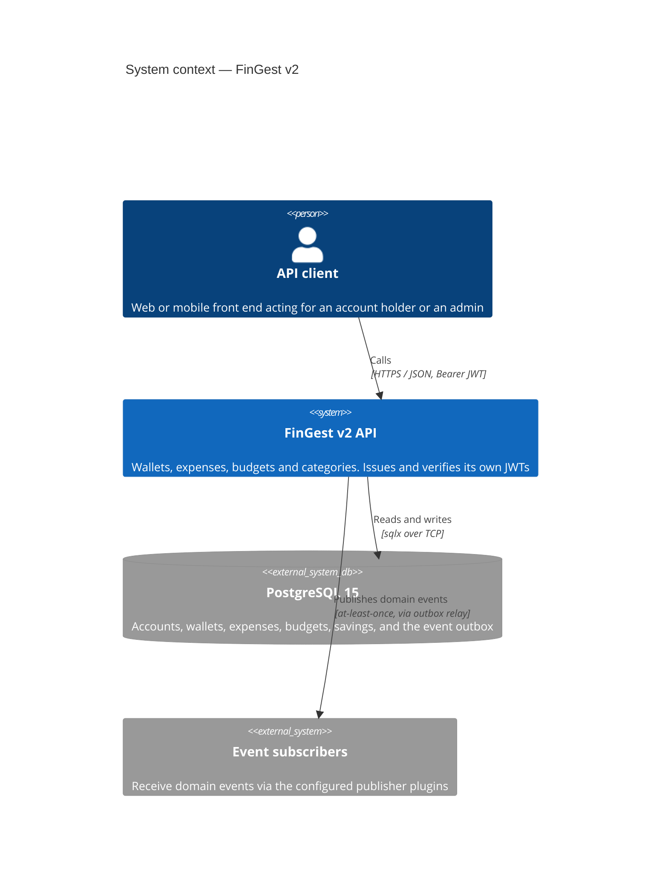
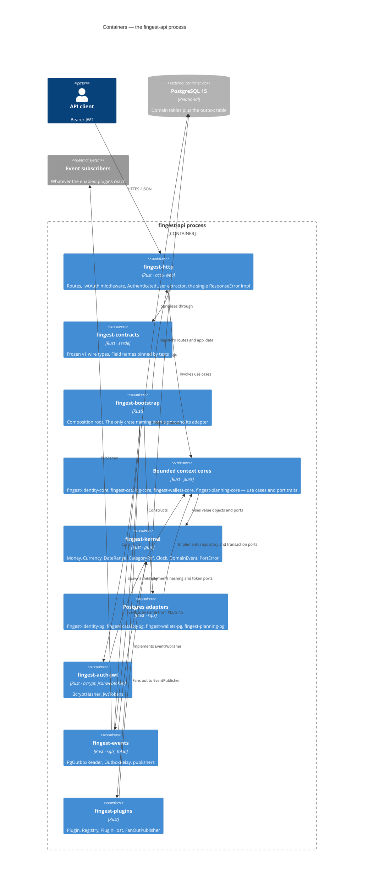
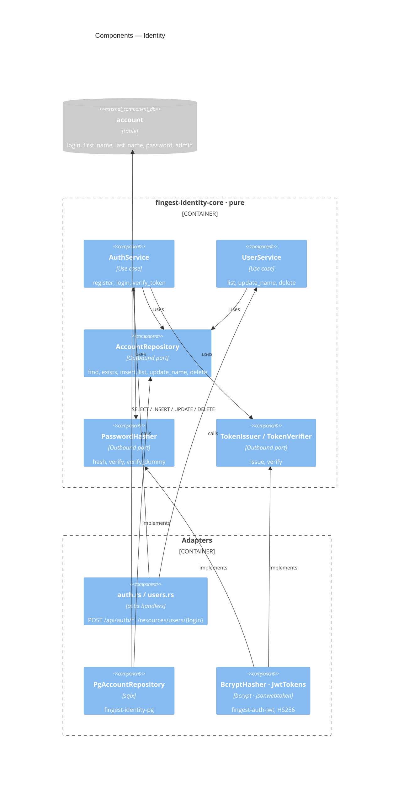
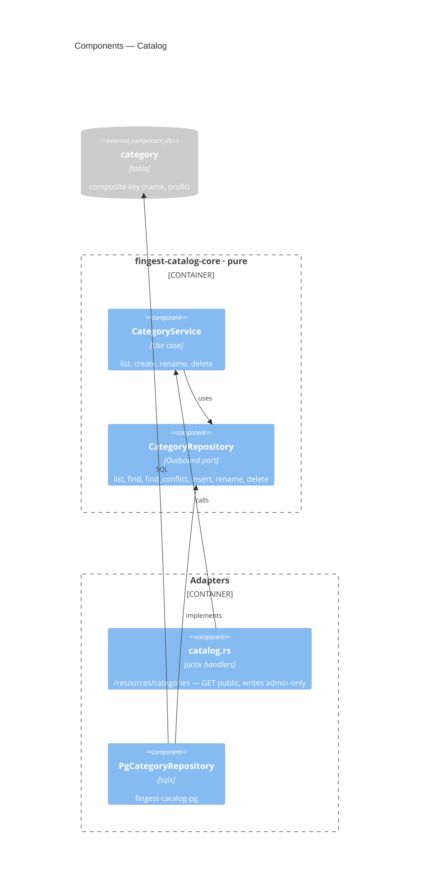
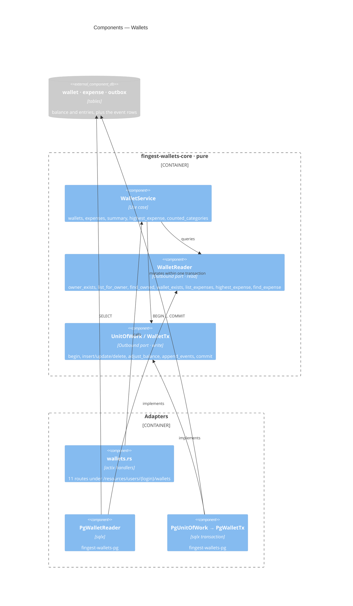
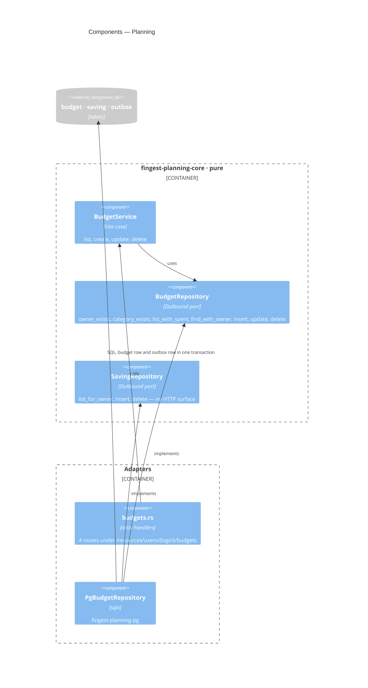
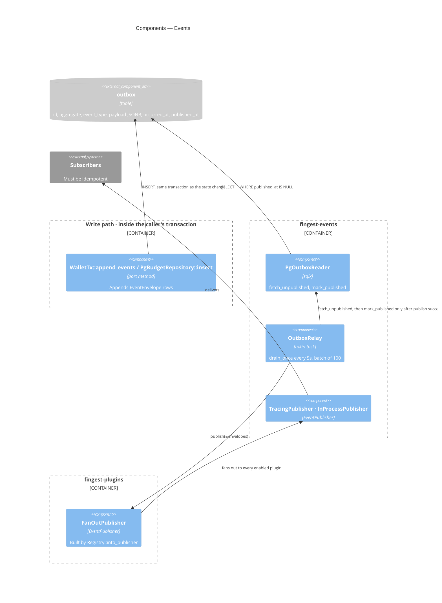
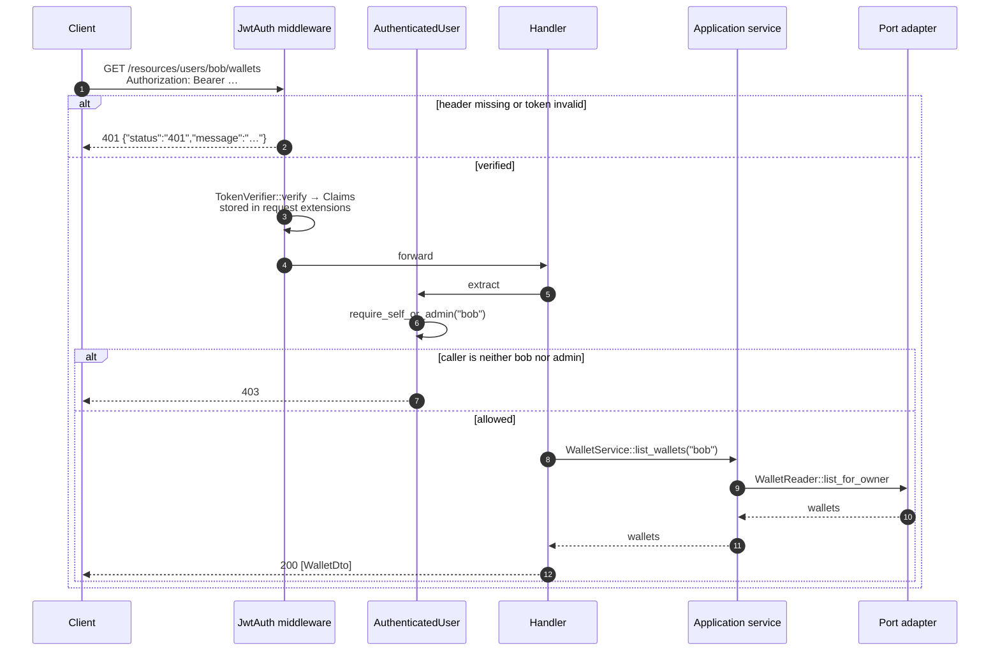
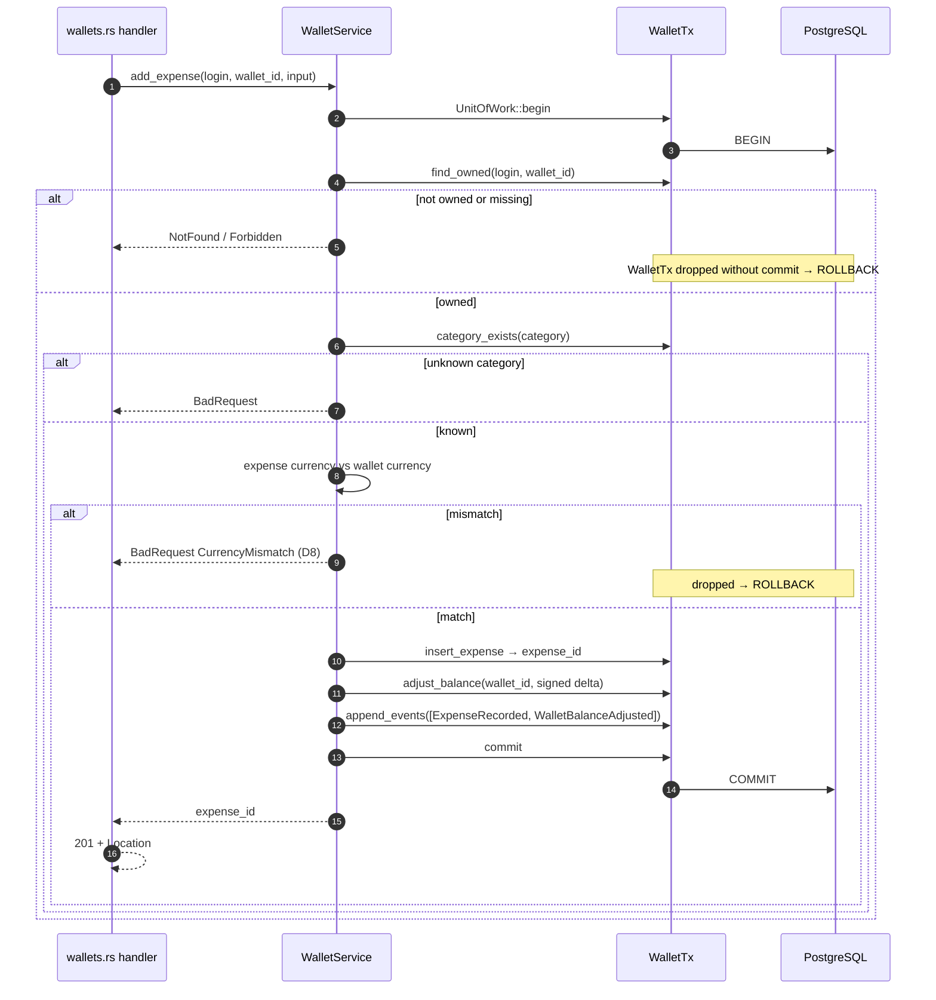
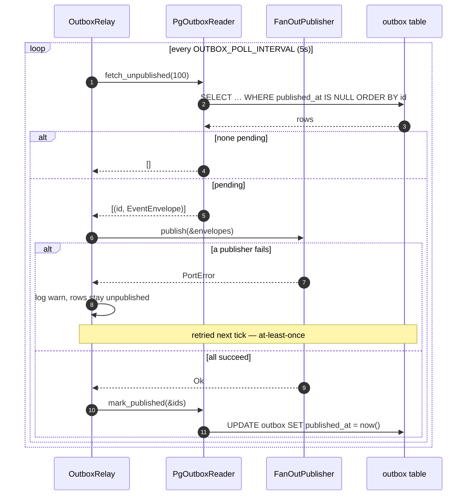

# Architecture

How FinGest v2 is put together, described with the [C4 model](https://c4model.com): system
context, containers, then components per bounded context. Each diagram names real crates,
traits and files — if a name here does not exist in the source, the document is wrong.

The decisions behind the structure are recorded separately in [adr/](adr/).

## Contents

- [Scope](#scope)
- [Level 1 — System context](#level-1--system-context)
- [Level 2 — Containers](#level-2--containers)
- [Level 3 — Components](#level-3--components)
  - [Identity](#identity)
  - [Catalog](#catalog)
  - [Wallets](#wallets)
  - [Planning](#planning)
  - [Events](#events)
- [Runtime views](#runtime-views)
- [Architecture patterns](#architecture-patterns)
- [Where the architecture is enforced](#where-the-architecture-is-enforced)
- [Startup and wiring](#startup-and-wiring)
- [Deliberate deviations](#deliberate-deviations)

## Scope

FinGest v2 is a single-process HTTP API over one PostgreSQL database. It is a re-architecture
of [finGest-rs](../../finGest-rs), preserving the wire contract while relocating the business
rules out of the handlers. v1's documentation describes a layered system; this one is
hexagonal, so the two documents are not comparable view-for-view.

Everything below describes the code as committed. Where the implementation deviates from what
the architecture would suggest, it is listed in [Deliberate deviations](#deliberate-deviations)
rather than smoothed over.

## Level 1 — System context

Authentication is self-contained: the API issues its own tokens with `JwtTokens`
(`crates/fingest-auth-jwt`) and verifies them with the same adapter. There is no external
identity provider — the sibling Java project in this repository uses Keycloak, this one does
not.

## Level 2 — Containers

One deployable process, `bins/fingest-api`. The boxes inside it are crates, drawn as
containers because the crate boundary is where the dependency rule is enforced
([ADR-0002](adr/0002-enforce-dependency-rule-with-a-test.md)).

Every arrow crossing the hexagon boundary points **inwards**. There is no arrow from a
`*-core` crate to an adapter, and that absence is the architecture.

`fingest-plugins` and `fingest-events` depend on `fingest-kernel` only. Neither knows what a
wallet is; they move `EventEnvelope` values.

## Level 3 — Components

Four bounded contexts, one diagram each. The shape repeats: an actix handler calls an
application service, the service calls a port trait, an adapter implements the trait. The
dashed boundary in each diagram is the edge of the hexagon — everything to its left compiles
without `sqlx`.

### Identity

Accounts, registration, login, token issuing and verification.
`crates/fingest-identity-core/src/{port,service}.rs`.

`PasswordHasher::verify_dummy` is a port method, not an implementation detail. `login` calls
it when no account matches, so a login for a non-existent account costs the same as one with
a wrong password. Putting it on the port is what makes the timing property testable without
bcrypt.

### Catalog

Categories: shared reference data, identified by the composite `(name, profit)`.
`crates/fingest-catalog-core/src/{port,service}.rs`.

`find_conflict` exists separately from `find` because duplicate detection is
case-insensitive while lookup is exact, and a rename must be able to exclude the row being
renamed from its own conflict check. A conflict is `CatalogError::Conflict`, which maps to
409 — v1 returned 500 here (D11).

### Wallets

The only context with a multi-statement invariant, and the reason
[ADR-0006](adr/0006-unit-of-work-and-read-write-split.md) exists.
`crates/fingest-wallets-core/src/{port,service}.rs`.

### Planning

Budgets and savings. `crates/fingest-planning-core/src/{port,service}.rs`.

`list_with_spent` filters on two independent windows — one bounding `start_date`, one
bounding `end_date` — and sums the owner's spending in the same query, reproducing v1's
behaviour exactly.

### Events

Cross-cutting. No bounded context depends on this; it depends on the kernel only.

## Runtime views

### An authenticated request

`JwtAuth` wraps the whole `/resources/users` scope, so verification happens once per request
and `AuthenticatedUser` reuses the claims the middleware deposited rather than verifying a
second time.

### Recording an expense

One transaction covers the row, the balance and the event. This is the path v1 got wrong in
three separate ways.

The delta passed to `adjust_balance` is computed by the aggregate from the category's
`profit` flag. No caller invents a sign.

### One outbox drain cycle

Relay errors are logged and retried on the next tick. The task is spawned detached, so a
broker outage never takes the API down with it.

## Architecture patterns

Each entry names the file that implements the pattern and, where one exists, the test that
keeps it true.

| Pattern | Where | What keeps it honest |
|---|---|---|
| **Hexagonal / ports & adapters** | `*-core` crates define traits; `*-pg`, `fingest-auth-jwt`, `fingest-http` implement or drive them | `crates/fingest-kernel/tests/dependency_rule.rs` · [ADR-0001](adr/0001-hexagonal-architecture.md) |
| **Enforced dependency rule** | Root `Cargo.toml` splits kernel-safe from adapter-only deps | The same test — it reads manifests, so it cannot be feature-flagged away · [ADR-0002](adr/0002-enforce-dependency-rule-with-a-test.md) |
| **Bounded contexts** | identity, catalog, wallets, planning — one crate each, no crate-to-crate edge between them | The compiler: an undeclared dependency does not build |
| **Shared kernel** | `fingest-kernel` — `Money`, `Currency`, `DateRange`, `CategoryRef`, `DomainEvent` | Kept minimal on purpose; anything context-specific belongs in that context |
| **Value objects** | `Currency` accepts 3 ASCII letters and uppercases them; `Money` rejects negatives; `DateRange` validates ordering | Construction is the only way in, so an invalid value has no representation (D9) |
| **Unit of Work** | `UnitOfWork` → `WalletTx`; `commit` takes `self: Box<Self>`, drop rolls back | `append_events` is on the transaction, so a write cannot commit without its event · [ADR-0006](adr/0006-unit-of-work-and-read-write-split.md) |
| **Read/write split (CQRS-lite)** | `WalletReader` for queries, `WalletTx` for mutations | A query physically cannot hold a transaction open |
| **Transactional outbox** | `migrations/20260906000000_outbox.sql`, `crates/fingest-events/src/relay.rs` | `published_at` is stamped only after a successful publish · [ADR-0003](adr/0003-transactional-outbox.md) |
| **Composition root** | `crates/fingest-bootstrap/src/lib.rs` — the only crate naming a port *and* its adapter | The dependency rule prevents any other crate from doing so |
| **Plugin registry + fan-out** | `fingest-plugins`: `Plugin`, `Registry`, `PluginHost`, `FanOutPublisher` | Unknown plugin name is `PluginError::Unknown` and stops startup · [ADR-0004](adr/0004-compile-time-plugin-registry.md) |
| **Published language** | `fingest-contracts` — every request/response shape, nothing else | Field-name tests in the crate; mapping lives in `fingest-http` so the wire format cannot follow the domain · [ADR-0005](adr/0005-frozen-wire-contracts.md) |
| **Clock injection** | `Clock` port in the kernel; `SystemClock` in production, `FixedClock` in tests | Time-dependent behaviour is deterministic without freezing the system clock |
| **Error translation at the boundary** | `crates/fingest-http/src/error.rs` — one `ResponseError` impl, `From` per context error | `PortError` other than `Conflict` collapses to a generic 500 and is logged, never echoed (D10) |
| **Policy objects on the extractor** | `AuthenticatedUser::require_admin`, `require_self_or_admin` | Authorization is a call in the handler, not a comment in a table |

## Where the architecture is enforced

| Rule | Mechanism | File |
|---|---|---|
| Kernel and `*-core` never touch an adapter crate | Test reading Cargo manifests | `crates/fingest-kernel/tests/dependency_rule.rs` |
| The dependency-rule test still checks something | `kernel_is_among_the_checked_crates` | same file |
| Savings stay unrouted | `savings_are_not_exposed` asserts 404 | `crates/fingest-http/src/resources.rs` |
| Every protected path needs a token | `every_protected_path_rejects_a_missing_token` | same file |
| Error body shape and status codes | Unit tests on `ApiError::error_response` | `crates/fingest-http/src/error.rs` |
| Wire field names | Serialisation tests | `crates/fingest-contracts/src/lib.rs` |
| SQL matches the schema | `cargo sqlx prepare --workspace --check -- --all-targets` | `.github/workflows/ci.yml` |
| No unsafe code | `unsafe_code = "forbid"` | root `Cargo.toml` |
| Lints are errors | `cargo clippy --workspace --all-targets -- -D warnings` | `.github/workflows/ci.yml` |

CI runs three jobs: `lint` (fmt + clippy), `test` (migrations, offline-metadata check, then
`cargo test --workspace` against a throwaway PostgreSQL 15 service container), and `docker`
(container build). There is no deployment pipeline.

## Startup and wiring

`fingest_bootstrap::run` (`crates/fingest-bootstrap/src/lib.rs`), in order:

1. `Config::from_env` — `from_source` is pure over its input, so configuration is testable
   without mutating process env. `JWT_SECRET` shorter than 32 characters is
   `ConfigError::WeakJwtSecret` and the process refuses to start (D12).
2. `init_tracing(log_level)`.
3. `connect` — `PgPool` with `db_max_connections`, then `sqlx::migrate!("../../migrations")`.
4. `plugin_host()` — registers `TracingPlugin` and `InProcessPlugin`, then
   `build(&config.plugins)` keeps only the names in `PLUGINS` and `into_publisher()`
   collapses them into a `FanOutPublisher`.
5. `spawn_outbox_relay` — detached `tokio` task polling every `OUTBOX_POLL_INTERVAL` (5s).
6. `Dependencies::build` — constructs every adapter, wraps each in `Arc<dyn Port>`, and puts
   the five application services plus `TokenVerifierRef` into actix `app_data`.
7. `HttpServer::new` — `Logger`, CORS (`GET POST PUT DELETE`, `Authorization` and
   `Content-Type`, credentials, `max_age` 3600), then `configure_routes`.

Environment variables and their defaults are listed under
[Configuration](../README.md#configuration) in the README.

## Deliberate deviations

Two places where the code does not follow the pattern the rest of the system uses. Each is
intentional; changing them would cost more than the consistency is worth.

**`saving` is modelled, persisted and unrouted.** `SavingRepository` and the `saving` table
exist; no HTTP route reaches them. This matches v1's surface, and
`savings_are_not_exposed` fails if anyone adds one by accident.

**`DateRange` uses sentinel dates for unbounded ranges.** Not `Option<NaiveDate>`. This
reproduces v1's filtering behaviour exactly, including at the boundaries, which a nullable
representation would have quietly changed.

---

See also: [README](../README.md) · [Deviations from v1](../README.md#deviations-from-v1) ·
[Decision records](adr/)
